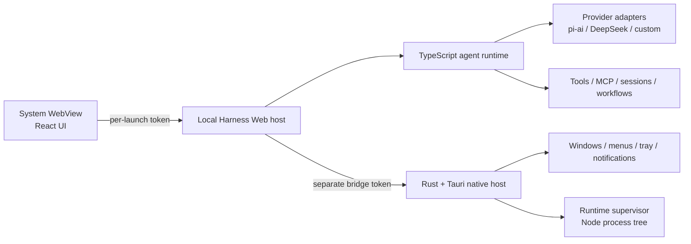

# Harness Desktop

English | [中文](README.zh.md)

**DeepSeek Harness, packaged for the desktop.**

Harness Desktop is an unofficial community distribution built on [DeepSeek Harness](https://github.com/deepseek-ai/deepseek-harness) and Tauri 2. It runs the full Harness agent runtime locally, adds a native desktop lifecycle, and keeps the existing TypeScript and React product core instead of shipping a second agent implementation.

> **Important:** This project is not affiliated with or endorsed by DeepSeek. It currently tracks the upstream `dsh-v0.1.1-rc.1` developer preview, where compatibility-breaking changes are expected.

## Why this exists

Electron would make a desktop build straightforward, but it would also bundle another Chromium runtime. Harness Desktop uses the operating system WebView through Tauri, while Rust owns the native application boundary and the existing TypeScript runtime continues to own agent orchestration.

That division is intentional:

- **Tauri 2 and Rust** own windows, menus, tray behavior, process supervision, notifications, autostart, update plumbing, and native diagnostics.
- **DeepSeek Harness and TypeScript** own agents, tools, sessions, models, MCP, workflows, settings, and the plugin graph.
- **React** remains the UI layer, rendered by WKWebView on macOS and WebView2 on Windows.

This is not a full Rust rewrite and it is not a GPUI-native interface. It is a lightweight desktop carrier around the actual Harness runtime, which keeps upstream features portable and avoids maintaining two agent systems.

## Highlights

- Full local DeepSeek Harness runtime, not a remote-control shell
- Tauri 2 desktop host without a bundled Chromium/Electron runtime
- Direct BYOK setup from **Settings → Models**
- Built-in catalog routes from `@earendil-works/pi-ai`, including DeepSeek, OpenAI, Anthropic, Google, Amazon Bedrock, OpenRouter, Moonshot/Kimi, Z.AI/GLM, Mistral, Qwen, xAI, and others
- Custom OpenAI-compatible providers, self-hosted endpoints, and company gateways without writing a new adapter
- Multimodal image input when the selected provider/model declares image capability
- Local sessions, tools, MCP, subagents, workflows, skills, and permission controls
- Profile bundles, installable Cordis plugins, and the upstream read-only plugin inventory
- Optional official Codex and Claude Code subagent bundles; each uses the corresponding locally installed and authenticated product CLI and is not bundled by default
- Isolated desktop data directory, separate from an existing `dsh` CLI profile
- Native macOS and Windows packaging, with target-native CI

## Architecture



The app opens a local loading page immediately. Its Rust supervisor starts the bundled Node.js executable and the closed production dependency graph for `dsh web`, waits for the authenticated loopback listener, and then navigates the same WebView to the local Harness UI.

Two independent 256-bit random tokens are created on every launch: one protects WebView-to-Harness HTTP and WebSocket traffic, while the other protects the narrow Harness-to-native bridge. The supervisor owns the complete child process tree and terminates descendants when the app exits.

See the [desktop architecture and release notes](apps/desktop/README.md) for the detailed boundary.

## Model providers

Harness Desktop does not maintain a separate provider abstraction. It uses the upstream Harness LLM seam and its generic [`@earendil-works/pi-ai`](https://www.npmjs.com/package/@earendil-works/pi-ai) adapter.

There are two practical deployment modes:

1. **Direct BYOK** — configure a catalog provider and store its API key locally through **Settings → Models**.
2. **Gateway mode** — add an OpenAI-compatible endpoint such as an internal gateway or OpenRouter. Routing, budgets, audit, billing, and organization policy can stay in that gateway.

Provider support is model- and authentication-dependent. Bedrock, Vertex, Azure, and OAuth-only routes require their native credentials or setup rather than a generic API key. For custom endpoints and vision declarations, see the upstream [provider guide](docs/user/guide/providers.md).

## Run

### Requirements

- Node.js 22
- pnpm 11.7
- Rust stable
- The [Tauri 2 platform prerequisites](https://v2.tauri.app/start/prerequisites/) for macOS or Windows

### Run from source

```sh
git clone https://github.com/Bestbbb/deepseek-harness-desktop.git
cd deepseek-harness-desktop
pnpm install --frozen-lockfile
pnpm run desktop:prepare
pnpm run desktop:dev
```

`desktop:prepare` builds Harness, creates the production runtime closure, downloads the matching official Node.js runtime, verifies its checksum, and materializes the resources consumed by Tauri.

### Build an installer

```sh
pnpm run desktop:build
```

macOS builds produce an `.app` and `.dmg`. Windows builds produce a per-user NSIS `.exe` installer. The bundled Harness runtime contains more than 32,000 files, so the Windows profile intentionally avoids WiX/MSI's practical file-table limits. Installers should be built on their target operating system; the repository CI runs the same preparation, smoke tests, Rust tests, and packaging steps on macOS arm64 and Windows x64.

## Current release status

This repository is a developer preview. Local macOS builds use an ad-hoc signature and are not notarized. Local Windows builds are unsigned and may trigger SmartScreen. Public, trusted binary releases still require:

- Apple Developer ID signing and notarization
- Windows code signing
- A Tauri updater signing key and release endpoint
- Clean macOS and Windows CI artifacts

Until those gates are provisioned, building from source is the supported evaluation path.

## Security boundary

- Both local network surfaces require independent per-launch tokens.
- The native bridge exposes only an explicit allowlist of desktop operations.
- Desktop state lives in its own Harness home rather than modifying the CLI profile.
- Exported diagnostics are bounded and redact tokens, bearer credentials, API-key fields, and the user home path.
- Provider keys use Harness's write-only local credential provider. OS Keychain and Windows Credential Manager integration are planned but are not implemented yet.

## Roadmap

- Signed and notarized macOS releases
- Signed Windows installers and automatic updates
- OS-native credential storage behind the existing Harness credential seam
- A final independent icon and visual identity
- Smaller runtime bundles and startup profiling
- Continuous upstream synchronization as DeepSeek Harness evolves

## Upstream and contributing

The desktop layer is intentionally narrow so upstream Harness improvements can continue to land without a rewrite. General Harness issues belong in the [upstream repository](https://github.com/deepseek-ai/deepseek-harness); desktop packaging, native lifecycle, and desktop UX issues belong here.

For development conventions, see [CONTRIBUTING.md](CONTRIBUTING.md), [AGENTS.md](AGENTS.md), and the [development guide](docs/development.md).

## License

[MIT](LICENSE). Third-party dependencies and their licenses are listed in [THIRD_PARTY_NOTICES.md](THIRD_PARTY_NOTICES.md).

DeepSeek and DeepSeek Harness are names associated with their respective owners. This community project makes no claim of official status.
