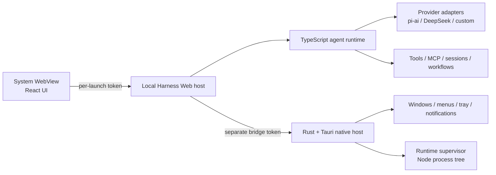

# Harness Desktop

English | [中文](README.zh.md)

**DeepSeek Harness as a lightweight native desktop app — full local runtime, system WebView, no Electron.**

[Download for macOS (Apple Silicon)](https://github.com/Bestbbb/deepseek-harness-desktop/releases/download/v0.1.1-rc.1/Harness.Desktop_0.1.1-rc.1_aarch64.dmg) · [Download for Windows (x64)](https://github.com/Bestbbb/deepseek-harness-desktop/releases/download/v0.1.1-rc.1/Harness.Desktop_0.1.1-rc.1_x64-setup.exe) · [Release notes](https://github.com/Bestbbb/deepseek-harness-desktop/releases/tag/v0.1.1-rc.1)

Installer users do not need Node.js, pnpm, Rust, or an existing `dsh` installation.


> Harness Desktop is an unofficial community distribution built on [DeepSeek Harness](https://github.com/deepseek-ai/deepseek-harness) and Tauri 2. It is not affiliated with or endorsed by DeepSeek. This preview tracks upstream `dsh-v0.1.1-rc.1`; compatibility-breaking changes are still possible.

<a id="run"></a>

## Start in three steps

1. Install and open Harness Desktop.
2. Open **Settings → Models** and add a provider API key or an OpenAI-compatible endpoint.
3. Choose a workspace, Agent preset, and model, then describe what you want to build.

The macOS preview is ad-hoc signed and not notarized; the Windows preview is unsigned and may trigger SmartScreen. Download only from this repository, verify the release checksums, and follow the platform note on the release page if the operating system blocks the first launch.

## What you get

- The complete local DeepSeek Harness agent runtime, not a remote-control shell
- A Tauri 2 host using WKWebView on macOS and WebView2 on Windows, without bundling Chromium
- Local sessions, tools, MCP, subagents, workflows, skills, permissions, and multimodal image input
- Direct BYOK setup for DeepSeek, OpenAI, Anthropic, Google, Amazon Bedrock, OpenRouter, Moonshot/Kimi, Z.AI/GLM, Mistral, Qwen, xAI, and other catalog providers
- Custom OpenAI-compatible providers for self-hosted models and company gateways, without writing a new adapter
- Optional Codex and Claude Code subagent providers backed by the official product runtimes
- An isolated desktop data directory that does not modify an existing `dsh` CLI profile
- Target-native macOS arm64 and Windows x64 builds exercised by the repository CI

## Why Tauri instead of Electron?

Electron would be easy to package, but it would ship another Chromium runtime and move the product toward a desktop-specific fork. Harness Desktop keeps the established TypeScript/React product core and gives only the native boundary to Rust.

- **Tauri 2 and Rust** own windows, menus, tray behavior, process supervision, notifications, autostart, update plumbing, and native diagnostics.
- **DeepSeek Harness and TypeScript** own agents, tools, sessions, models, MCP, workflows, settings, and the plugin graph.
- **React** remains the UI layer and renders in the operating system WebView.

This is deliberately not a full Rust rewrite or a GPUI-native interface. Reusing the upstream runtime is what lets desktop releases inherit new Harness capabilities without maintaining a second agent system.

## Models and gateways

Harness Desktop does not maintain a second provider abstraction. It uses the upstream Harness LLM seam and the generic [`@earendil-works/pi-ai`](https://www.npmjs.com/package/@earendil-works/pi-ai) adapter.

There are two practical deployment modes:

1. **Direct BYOK** — choose a catalog provider in **Settings → Models** and store its API key locally.
2. **Gateway mode** — add an OpenAI-compatible endpoint such as an internal gateway or OpenRouter; routing, budgets, audit, billing, and organization policy can remain in the gateway.

Provider support is model- and authentication-dependent. Bedrock, Vertex, Azure, and OAuth-only routes require their native credentials or setup rather than a generic API key. See the upstream [provider guide](docs/user/guide/providers.md) for custom endpoints and vision declarations.

## Codex and Claude Code as subagents

Codex and Claude Code are independent optional Profile Bundles. Each bundle brings its pinned official wrapper or SDK and the matching platform payload; it does not look for an arbitrary `codex` or `claude` binary on `PATH`. The provider still reuses the product's native account state and configuration from the user's normal home or `CODEX_HOME`, and it never logs in or changes that configuration on the user's behalf.

Installing a bundle makes its dormant provider available after the Profile restarts. A copied Agent preset must then enable the matching Codex or Claude Code tool for new sessions. See the [CLI Profile Bundle reference](apps/cli/reference/README.md), [Codex provider](packages/subagent/subagent-codex/README.md), and [Claude Code provider](packages/subagent/subagent-claude-code/README.md) for the exact lifecycle and permission model.

## Architecture



The app opens a local loading page immediately. Its Rust supervisor starts the bundled Node.js executable and the closed production dependency graph for `dsh web`, waits for the authenticated loopback listener, and then navigates the same WebView to the local Harness UI.

Two independent 256-bit random tokens are created on every launch: one protects WebView-to-Harness HTTP and WebSocket traffic, while the other protects the narrow Harness-to-native bridge. The supervisor owns the complete child process tree and terminates descendants when the app exits. See the [desktop architecture](apps/desktop/README.md) for the detailed boundary.

<a id="run-from-source"></a>

## Build from source

Source development requires Node.js 22, pnpm 11.7, Rust stable, and the [Tauri 2 platform prerequisites](https://v2.tauri.app/start/prerequisites/) for macOS or Windows.

```sh
git clone https://github.com/Bestbbb/deepseek-harness-desktop.git
cd deepseek-harness-desktop
pnpm install --frozen-lockfile
pnpm run desktop:prepare
pnpm run desktop:dev
```

Build an installer with:

```sh
pnpm run desktop:build
```

`desktop:prepare` builds Harness, creates the production runtime closure, downloads the matching official Node.js runtime, verifies its checksum, and materializes the resources consumed by Tauri. macOS builds produce an `.app` and `.dmg`; Windows builds produce a per-user NSIS `.exe`. Build installers on their target operating system, or use the repository's target-native Desktop workflow.

## Security and release status

- Both local network surfaces require independent per-launch tokens.
- The native bridge exposes only an explicit allowlist of desktop operations.
- Desktop state lives in its own Harness home rather than modifying the CLI profile.
- Exported diagnostics are bounded and redact tokens, bearer credentials, API-key fields, and the user home path.
- Provider keys use Harness's write-only local credential provider; OS Keychain and Windows Credential Manager integration is planned but not implemented yet.
- Trusted distribution still requires Apple Developer ID notarization, Windows code signing, and a production Tauri updater key.

## Roadmap

- Signed and notarized macOS releases
- Signed Windows installers and automatic updates
- OS-native credential storage behind the existing Harness credential seam
- Smaller runtime bundles and startup profiling
- Continuous upstream synchronization as DeepSeek Harness evolves

## Upstream and contributing

The desktop layer is intentionally narrow so upstream Harness improvements can continue to land without a rewrite. General Harness issues belong in the [upstream repository](https://github.com/deepseek-ai/deepseek-harness); desktop packaging, native lifecycle, and desktop UX issues belong here.

For development conventions, see [CONTRIBUTING.md](CONTRIBUTING.md), [AGENTS.md](AGENTS.md), and the [development guide](docs/development.md). If Harness Desktop is useful to you, a GitHub star and a concrete issue report are the best ways to help the project grow.

## License

[MIT](LICENSE). Third-party dependencies and their licenses are listed in [THIRD_PARTY_NOTICES.md](THIRD_PARTY_NOTICES.md).

DeepSeek and DeepSeek Harness are names associated with their respective owners. This community project makes no claim of official status.
