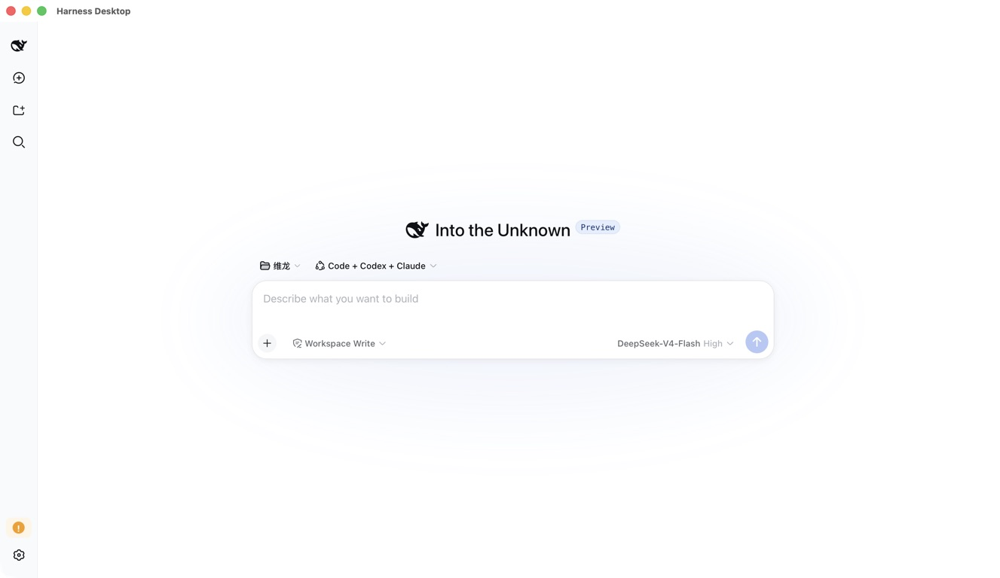

# Harness Desktop

[English](README.md) | 中文

**在桌面上使用 DeepSeek Harness。自主选择工作区、模型和插件。**

这是基于 [DeepSeek Harness](https://github.com/deepseek-ai/deepseek-harness) 和 Tauri 2 的开源 macOS、Windows 应用。agent（智能体）运行时在本地执行，系统 WebView 展示界面，Rust 负责原生集成。不内置 Electron 或 Chromium。

[下载](https://github.com/Bestbbb/deepseek-harness-desktop/releases) · [快速开始](#run) · [文档](docs/user/index.zh.md) · [报告问题](https://github.com/Bestbbb/deepseek-harness-desktop/issues)



> 非官方社区项目，与 DeepSeek 无隶属关系，也未获得其背书。当前源码跟随上游 `dsh-v0.1.3-alpha.1`；各安装包内置版本以对应发布说明为准。预览版本可能包含破坏性变更。

<a id="run"></a>

## 三步开始

1. **安装应用。** 在 [Releases](https://github.com/Bestbbb/deepseek-harness-desktop/releases) 选择 macOS Apple Silicon DMG 或 Windows x64 安装器。使用安装包不需要另装 Node.js、pnpm、Rust 或 CLI（命令行界面）。
2. **连接模型。** 打开 **Settings → Models**，配置提供方或 OpenAI 兼容端点，并使用该提供方要求的认证方式。
3. **选择工作区。** 选择文件夹、模型和 Agent preset，然后描述任务。

macOS 预览包有 ad-hoc 签名，但未公证；Windows 预览包未签名。操作系统可能阻止首次启动。允许运行前，请阅读发布页的校验方式和平台说明。

## 提供什么

- **本地编程工作区。** 文件、终端工具、图片输入、持久化会话以及上游 Harness 会话界面。
- **自主选择模型。** DeepSeek 适配器和上游 `pi-ai` 集成，包含目录中的提供方和自定义 OpenAI 兼容端点。
- **可组合能力。** Cordis 插件、Agent preset、skill（技能）和 MCP 集成，配有明确的配置与权限。
- **原生桌面操作。** 窗口、菜单、托盘、快捷键、运行时管理、通知及诊断导出。
- **可选外部 agent。** 安装、配置并完成认证后，上游 Codex 和 Claude Code 组合包可执行委派任务。
- **优先复用上游。** 桌面宿主沿用 Harness 运行时与 Web profile，不维护第二套 agent 实现。

本地运行时不等于离线推理。请求会发往你选择的模型提供方或网关。提供方费用、订阅和认证要求仍由你负责。

## 为什么选择 Tauri 而不是 Electron？

桌面应用不需要随包分发自己的浏览器引擎。Tauri 在 macOS 上使用 WKWebView，在 Windows 上使用 WebView2；现有 TypeScript 运行时则在受管理的 Node 进程中执行。

| 层次 | 职责 |
|---|---|
| Rust + Tauri | 原生窗口、菜单、操作系统集成及进程生命周期 |
| DeepSeek Harness | agent 执行、工具、权限、会话及插件组合 |
| React + 系统 WebView | 上游会话与设置界面 |
| 提供方适配器 | 模型请求、流式输出和提供方特定认证 |

这不是 GPUI 界面，也不是完整 Rust 重写。不内置 Chromium 可以减少一项分发开销，但不能保证固定的内存占用，也不能替代长会话性能分析。

## 模型与网关

在 **Settings → Models** 中添加目录提供方或自定义端点。桌面应用使用上游适配器，不引入另一套模型网关。

DeepSeek、OpenAI、Anthropic、Google、Kimi、GLM 等提供方取决于可用模型和支持的认证方式。Bedrock、Vertex、Azure 及 OAuth 路由可能需要原生配置，而不是通用 API key。详见[提供方指南](docs/user/guide/providers.zh.md)。

OpenAI 兼容的企业网关可以在桌面应用之外管理路由、预算和组织策略。兼容端点仍需正确声明模型能力，包括图片支持。

## Codex 和 Claude Code subagent

它们是可选的 Profile Bundle，不是内置账户或可互换的模型。官方包内运行时负责委派任务，使用各自产品的认证。安装组合包不会自动向所有 Agent preset 授予其工具权限。

安装、模型选择和无人值守权限行为见 [Codex 提供方](packages/subagent/subagent-codex/README.zh.md)与 [Claude Code 提供方](packages/subagent/subagent-claude-code/README.zh.md)。上游已集成 Pi 的模型库；当前不包含完整 Pi coding agent（编程智能体）适配器。

## 架构

应用打开本地加载页，启动内置 Node 运行时，再打开经过认证的 Harness Web profile。桌面状态使用独立的应用数据目录，不修改另行安装的 CLI profile。

WebView 将上游启动 token 交换为 HttpOnly cookie。Node 到 Rust 的原生 bridge 使用独立的每次启动 token。Rust 管理运行时及其后代进程。进程、认证和打包细节见[桌面架构与开发](apps/desktop/README.zh.md)。

<a id="run-from-source"></a>

## 从源码构建

安装[桌面构建依赖](apps/desktop/README.zh.md#development)，包括目标平台的原生编译器。在本仓库中执行：

```sh
pnpm install --frozen-lockfile
pnpm run desktop:prepare
pnpm run desktop:smoke
pnpm run desktop:dev
```

使用 `pnpm run desktop:build` 构建安装包。[Desktop 工作流](.github/workflows/desktop.yml) 在 macOS arm64 和 Windows x64 上构建。合并上游后，`pnpm run desktop:sync` 重新生成运行时依赖清单；`pnpm run desktop:verify` 会在打包前检查该清单。

## 安全与发布状态

- 预览安装包不能替代经过签名和公证的发行包。配置签名及更新端点前，自动更新保持关闭。
- 提供方凭据使用 Harness 本地凭据存储，不使用 macOS Keychain 或 Windows Credential Manager。
- 运行时诊断有大小上限，并脱敏常见敏感字段；不包含会话或配置正文。
- 插件和外部 agent 会执行代码。本地 bridge token 不是可信插件的沙箱，外部 agent 也不会自动继承 Harness 的工具限制。
- 授予工作区访问权限前，请阅读上游[安全说明](SAFETY.zh.md)。

## 路线图

[桌面开发指南](apps/desktop/README.zh.md#following-upstream) 说明版本对齐流程。后续方向包括操作系统凭据存储、签名更新、运行时性能分析和更完整的本地 agent 集成。这些是开发方向，不是当前安装包承诺提供的功能。

## 上游与贡献

[DeepSeek Harness](https://github.com/deepseek-ai/deepseek-harness) 维护底层 agent harness（智能体框架）。本仓库负责社区桌面发行版、原生集成和打包。请在这里报告桌面相关问题，并附上操作系统、应用版本及脱敏后的诊断信息。

参见 [CONTRIBUTING.md](CONTRIBUTING.zh.md) 与[开发指南](docs/development.zh.md)。Star 帮助其他人发现项目；可复现的问题报告和聚焦的 PR（Pull Request）帮助改进产品。

## 许可证

[MIT](LICENSE)。依赖许可证见 [THIRD_PARTY_NOTICES.md](THIRD_PARTY_NOTICES.md)。DeepSeek 与 DeepSeek Harness 名称仍归各自权利人所有。
