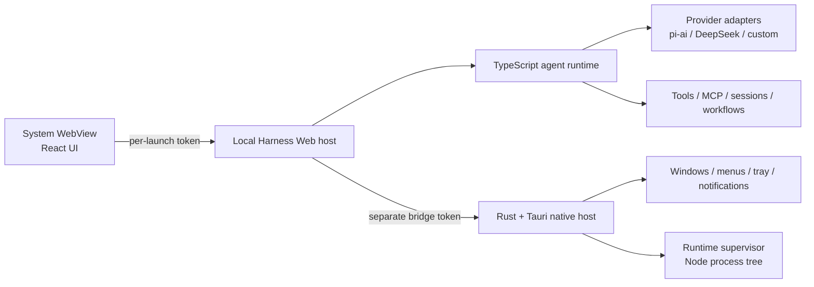

# Harness Desktop

[English](README.md) | 中文

**把 DeepSeek Harness 真正装进桌面端。**

Harness Desktop 是一个基于 [DeepSeek Harness](https://github.com/deepseek-ai/deepseek-harness) 与 Tauri 2 的非官方社区发行版。它在本地运行完整的 Harness Agent 运行时，增加原生桌面生命周期，同时保留现有 TypeScript 与 React 产品核心，而不是维护第二套 Agent 实现。

> **重要：** 本项目与 DeepSeek 无从属关系，也未获得其官方背书。当前版本跟随上游 `dsh-v0.1.0-rc.8` 开发者预览版，未来可能出现破坏兼容性的变更。

## 为什么做这个项目

Electron 可以快速完成桌面封装，但也会额外捆绑一套 Chromium。Harness Desktop 通过 Tauri 使用操作系统 WebView，由 Rust 管理原生应用边界，现有 TypeScript 运行时继续负责 Agent 编排。

这套分工是有意为之：

- **Tauri 2 与 Rust** 负责窗口、菜单、托盘、进程监管、通知、开机启动、更新基础设施和原生诊断。
- **DeepSeek Harness 与 TypeScript** 负责 Agent、工具、会话、模型、MCP、工作流、设置和插件图。
- **React** 继续作为界面层，在 macOS 的 WKWebView 与 Windows 的 WebView2 中渲染。

它不是一次完整的 Rust 重写，也不是 GPUI 原生界面，而是围绕真实 Harness 运行时构建的轻量桌面载体。这能持续迁移上游功能，并避免同时维护两套 Agent 系统。

## 特性

- 完整的本地 DeepSeek Harness 运行时，而不是远程控制壳
- 基于 Tauri 2，不捆绑 Chromium/Electron 运行时
- 在 **设置 → 模型** 中直接配置 BYOK
- 继承 `@earendil-works/pi-ai` 内置目录，包括 DeepSeek、OpenAI、Anthropic、Google、Amazon Bedrock、OpenRouter、Moonshot/Kimi、Z.AI/GLM、Mistral、Qwen、xAI 等
- 无需编写新适配器即可接入 OpenAI-compatible、自建端点和企业网关
- 当所选提供方和模型声明图片能力时支持多模态图片输入
- 本地会话、工具、MCP、subagent、工作流、skill 与权限控制
- 独立桌面数据目录，不影响已有 `dsh` CLI profile
- macOS 与 Windows 原生打包，以及目标平台 CI

## 架构



应用会立即打开本地加载页。Rust supervisor 启动随包分发的 Node.js 可执行文件和 `dsh web` 的闭合生产依赖图，等待经过认证的回环监听器就绪，再把同一个 WebView 导航到本地 Harness UI。

每次启动都会生成两枚互相独立的 256-bit 随机 token：一枚保护 WebView 到 Harness 的 HTTP 与 WebSocket 流量，另一枚保护受限的 Harness 到原生 bridge。supervisor 拥有完整子进程树，并在应用退出时终止所有后代进程。

详细边界请参阅[桌面架构与发布说明](apps/desktop/README.md)。

## 模型提供方

Harness Desktop 不维护单独的提供方抽象，而是直接使用上游 Harness LLM seam 及其通用 [`@earendil-works/pi-ai`](https://www.npmjs.com/package/@earendil-works/pi-ai) 适配器。

实际部署有两种方式：

1. **直接 BYOK** — 在 **设置 → 模型** 中配置目录提供方，并把 API key 存在本地。
2. **网关模式** — 添加企业内部网关或 OpenRouter 等 OpenAI-compatible 端点；路由、预算、审计、计费与组织策略可以继续留在网关层。

提供方支持取决于具体模型与认证方式。Bedrock、Vertex、Azure 与仅 OAuth 的路由需要各自的原生凭据或设置，不能只填通用 API key。自定义端点与视觉能力声明见上游[提供方指南](docs/user/guide/providers.md)。

## 运行

### 环境要求

- Node.js 22
- pnpm 11.7
- Rust stable
- macOS 或 Windows 对应的 [Tauri 2 平台依赖](https://v2.tauri.app/start/prerequisites/)

### 从源码运行

```sh
git clone https://github.com/Bestbbb/deepseek-harness-desktop.git
cd deepseek-harness-desktop
pnpm install --frozen-lockfile
pnpm run desktop:prepare
pnpm run desktop:dev
```

`desktop:prepare` 会构建 Harness、生成闭合生产运行时、下载匹配的官方 Node.js 运行时、校验 checksum，并生成 Tauri 使用的资源目录。

### 构建安装包

```sh
pnpm run desktop:build
```

macOS 构建产出 `.app` 和 `.dmg`；Windows 构建产出 MSI 与当前用户级 NSIS 安装包。安装器应在目标操作系统上构建；仓库 CI 会在 macOS arm64 与 Windows x64 上执行相同的准备、冒烟、Rust 测试和打包步骤。

## 当前发布状态

本仓库处于开发者预览阶段。本地 macOS 构建使用 ad-hoc 签名且未公证；本地 Windows 构建没有签名，可能触发 SmartScreen。公开可信的二进制发布仍需要：

- Apple Developer ID 签名与公证
- Windows 代码签名
- Tauri 更新签名密钥和发布端点
- 通过 macOS 与 Windows CI 的干净产物

在这些门槛配置完成前，从源码构建是受支持的试用方式。

## 安全边界

- 两个本地网络接口分别要求独立、每次启动生成的 token。
- 原生 bridge 只公开明确列入 allowlist 的桌面操作。
- 桌面状态保存在独立 Harness home 中，不修改 CLI profile。
- 导出的诊断信息有大小上限，并会脱敏 token、Bearer 凭据、API-key 字段和用户主目录路径。
- 提供方 key 使用 Harness 的只写本地凭据 provider；macOS Keychain 与 Windows Credential Manager 集成仍在规划中，尚未实现。

## 路线图

- 经过签名与公证的 macOS 发布
- 已签名的 Windows 安装器与自动更新
- 在现有 Harness 凭据 seam 后加入操作系统原生凭据存储
- 最终独立图标与视觉标识
- 更小的运行时包和启动性能分析
- 随 DeepSeek Harness 演进持续同步上游

## 上游与贡献

桌面层刻意保持狭窄，使上游 Harness 改进可以持续迁移而无需重写。通用 Harness 问题应提交到[上游仓库](https://github.com/deepseek-ai/deepseek-harness)；桌面打包、原生生命周期与桌面 UX 问题则应提交到本仓库。

开发约定见 [CONTRIBUTING.md](CONTRIBUTING.md)、[AGENTS.md](AGENTS.md) 与[开发指南](docs/development.md)。

## 许可证

[MIT](LICENSE)。第三方依赖及其许可证见 [THIRD_PARTY_NOTICES.md](THIRD_PARTY_NOTICES.md)。

DeepSeek 与 DeepSeek Harness 是其各自权利人的相关名称。本社区项目不宣称任何官方身份。
