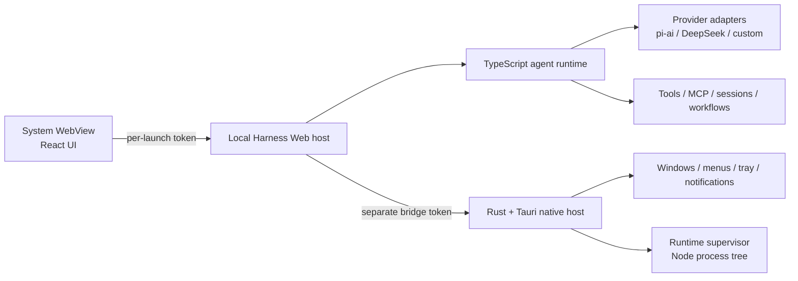

# Harness Desktop

[English](README.md) | 中文

**把 DeepSeek Harness 做成轻量原生桌面应用——完整本地运行时、系统 WebView，不用 Electron。**

[下载 macOS 版（Apple 芯片）](https://github.com/Bestbbb/deepseek-harness-desktop/releases/download/v0.1.1-rc.1/Harness.Desktop_0.1.1-rc.1_aarch64.dmg) · [下载 Windows 版（x64）](https://github.com/Bestbbb/deepseek-harness-desktop/releases/download/v0.1.1-rc.1/Harness.Desktop_0.1.1-rc.1_x64-setup.exe) · [查看发布说明](https://github.com/Bestbbb/deepseek-harness-desktop/releases/tag/v0.1.1-rc.1)

使用安装包不需要预先安装 Node.js、pnpm、Rust 或 `dsh`。


> Harness Desktop 是一个基于 [DeepSeek Harness](https://github.com/deepseek-ai/deepseek-harness) 与 Tauri 2 的非官方社区发行版，与 DeepSeek 无从属关系，也未获得其官方背书。当前预览版跟随上游 `dsh-v0.1.1-rc.1`，未来仍可能出现破坏兼容性的变更。

<a id="run"></a>

## 三步开始使用

1. 安装并打开 Harness Desktop。
2. 进入 **设置 → 模型**，添加模型提供方 API Key 或 OpenAI-compatible 端点。
3. 选择工作区、Agent preset 和模型，然后描述你想构建的内容。

macOS 预览版采用 ad-hoc 签名且尚未公证；Windows 预览版尚未签名，可能触发 SmartScreen。请只从本仓库下载，核对 Release 中的 checksum；如果操作系统阻止首次启动，请按 Release 页的平台说明处理。

## 你会得到什么

- 完整的本地 DeepSeek Harness Agent 运行时，而不是远程控制壳
- 基于 Tauri 2，在 macOS 使用 WKWebView、在 Windows 使用 WebView2，不捆绑 Chromium
- 本地会话、工具、MCP、subagent、工作流、skill、权限控制和多模态图片输入
- 直接 BYOK 接入 DeepSeek、OpenAI、Anthropic、Google、Amazon Bedrock、OpenRouter、Moonshot/Kimi、Z.AI/GLM、Mistral、Qwen、xAI 等目录提供方
- 无需编写新适配器即可接入 OpenAI-compatible、自建模型端点和企业网关
- 基于官方产品运行时的可选 Codex 与 Claude Code 子代理
- 独立桌面数据目录，不修改已有 `dsh` CLI profile
- 经仓库 CI 在目标平台实际构建的 macOS arm64 与 Windows x64 安装包

## 为什么选择 Tauri，而不是 Electron？

Electron 打包直接，但会额外分发一套 Chromium，并让产品逐渐走向桌面专用分叉。Harness Desktop 保留已经成熟的 TypeScript/React 产品核心，只把原生边界交给 Rust。

- **Tauri 2 与 Rust** 负责窗口、菜单、托盘、进程监管、通知、开机启动、更新基础设施和原生诊断。
- **DeepSeek Harness 与 TypeScript** 负责 Agent、工具、会话、模型、MCP、工作流、设置和插件图。
- **React** 继续作为界面层，在操作系统 WebView 中渲染。

它刻意不做完整 Rust 重写，也不是 GPUI 原生界面。复用上游运行时，桌面版才能持续获得新的 Harness 能力，而不必维护第二套 Agent 系统。

## 模型与网关

Harness Desktop 不维护第二套模型提供方抽象，而是直接使用上游 Harness LLM seam 及通用 [`@earendil-works/pi-ai`](https://www.npmjs.com/package/@earendil-works/pi-ai) 适配器。

实际部署有两种方式：

1. **直接 BYOK** — 在 **设置 → 模型** 中选择目录提供方，并把 API Key 保存在本地。
2. **网关模式** — 添加企业内部网关或 OpenRouter 等 OpenAI-compatible 端点；路由、预算、审计、计费和组织策略可以继续留在网关层。

提供方支持取决于具体模型与认证方式。Bedrock、Vertex、Azure 与仅 OAuth 的路由需要各自的原生凭据或设置，不能只填写通用 API Key。自定义端点与视觉能力声明见上游[提供方指南](docs/user/guide/providers.zh.md)。

## 把 Codex 与 Claude Code 用作子代理

Codex 与 Claude Code 是两个彼此独立的可选 Profile Bundle。每个 Bundle 都会带入锁定版本的官方 wrapper 或 SDK 及对应平台载荷，不会在 `PATH` 中随意寻找某个 `codex` 或 `claude` 可执行文件。提供方仍复用产品在用户普通 home 或 `CODEX_HOME` 中的原生账号状态和配置，也不会代替用户登录或修改配置。

安装 Bundle 并重启 Profile 后，对应的休眠 provider 才会可用；还需要在复制出的 Agent preset 中启用相应的 Codex 或 Claude Code 工具，新会话才能调用它。确切生命周期与权限模型见 [CLI Profile Bundle 说明](apps/cli/reference/README.zh.md)、[Codex provider](packages/subagent/subagent-codex/README.zh.md)和 [Claude Code provider](packages/subagent/subagent-claude-code/README.zh.md)。

## 架构



应用会立即打开本地加载页。Rust supervisor 启动随包分发的 Node.js 可执行文件和 `dsh web` 的闭合生产依赖图，等待经过认证的回环监听器就绪，再把同一个 WebView 导航到本地 Harness UI。

每次启动都会生成两枚互相独立的 256-bit 随机 token：一枚保护 WebView 到 Harness 的 HTTP 与 WebSocket 流量，另一枚保护受限的 Harness 到原生 bridge。supervisor 拥有完整子进程树，并在应用退出时终止所有后代进程。详细边界见[桌面架构说明](apps/desktop/README.zh.md)。

<a id="run-from-source"></a>

## 从源码构建

源码开发需要 Node.js 22、pnpm 11.7、Rust stable，以及 macOS 或 Windows 对应的 [Tauri 2 平台依赖](https://v2.tauri.app/start/prerequisites/)。

```sh
git clone https://github.com/Bestbbb/deepseek-harness-desktop.git
cd deepseek-harness-desktop
pnpm install --frozen-lockfile
pnpm run desktop:prepare
pnpm run desktop:dev
```

构建安装包：

```sh
pnpm run desktop:build
```

`desktop:prepare` 会构建 Harness、生成闭合生产运行时、下载匹配的官方 Node.js 运行时、校验 checksum，并生成 Tauri 使用的资源目录。macOS 构建产出 `.app` 与 `.dmg`；Windows 构建产出当前用户级 NSIS `.exe`。安装器应在目标操作系统上构建，也可以使用仓库中按目标平台运行的 Desktop workflow。

## 安全与发布状态

- 两个本地网络接口分别要求独立、每次启动生成的 token。
- 原生 bridge 只公开明确列入 allowlist 的桌面操作。
- 桌面状态保存在独立 Harness home 中，不修改 CLI profile。
- 导出的诊断信息有大小上限，并会脱敏 token、Bearer 凭据、API-key 字段和用户主目录路径。
- 提供方 key 使用 Harness 的只写本地凭据 provider；macOS Keychain 与 Windows Credential Manager 集成仍在规划中。
- 完成可信分发仍需要 Apple Developer ID 公证、Windows 代码签名和生产级 Tauri updater key。

## 路线图

- 经过签名与公证的 macOS 发布
- 已签名的 Windows 安装器与自动更新
- 在现有 Harness 凭据 seam 后加入操作系统原生凭据存储
- 更小的运行时包和启动性能分析
- 随 DeepSeek Harness 演进持续同步上游

## 上游与贡献

桌面层刻意保持狭窄，使上游 Harness 改进可以持续迁移而无需重写。通用 Harness 问题应提交到[上游仓库](https://github.com/deepseek-ai/deepseek-harness)；桌面打包、原生生命周期与桌面 UX 问题则应提交到本仓库。

开发约定见 [CONTRIBUTING.md](CONTRIBUTING.zh.md)、[AGENTS.md](AGENTS.md) 与[开发指南](docs/development.zh.md)。如果 Harness Desktop 对你有用，给仓库一个 Star，或者提交带复现信息的 Issue，就是对项目最直接的帮助。

## 许可证

[MIT](LICENSE)。第三方依赖及其许可证见 [THIRD_PARTY_NOTICES.md](THIRD_PARTY_NOTICES.md)。

DeepSeek 与 DeepSeek Harness 是其各自权利人的相关名称。本社区项目不宣称任何官方身份。
