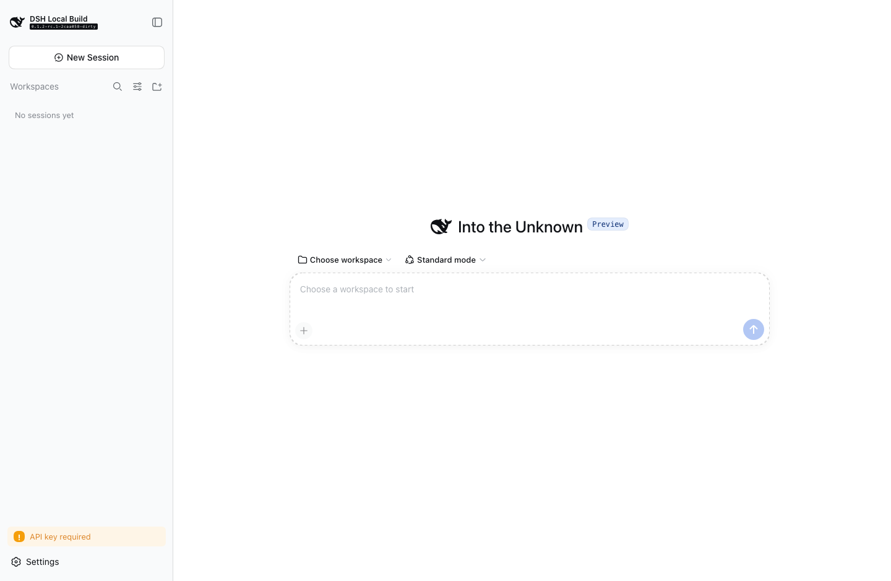
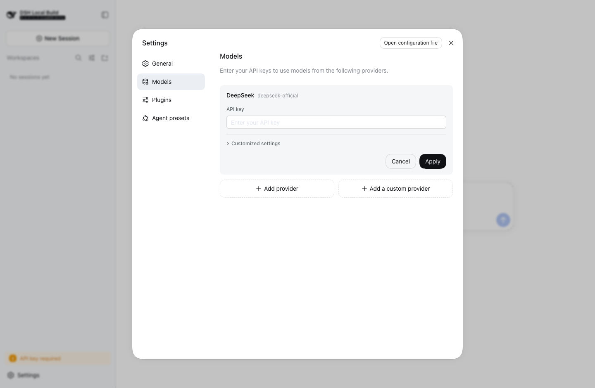

<main class="dsh-home"><section class="dsh-hero">

# 在桌面上使用 DeepSeek Harness。

在本地项目中使用自己选择的模型，通过插件组合 agent（智能体）的能力。

[下载](https://github.com/Bestbbb/deepseek-harness-desktop/releases) [阅读指南](./guide/quickstart.md)

</section>

<section class="dsh-models">

## 选择适合你的模型。

配置 DeepSeek、其他受支持的提供方，或兼容 OpenAI 的网关。推理和计费由模型提供方负责。

[模型配置与认证](./guide/providers.md)

</section>

<section class="dsh-extension">

## 可按需扩展的桌面应用。

Harness 负责 agent 运行时，Tauri 提供原生窗口和操作系统集成。

### 需要原生能力的地方，使用原生实现

系统 WebView、原生菜单、快捷键、运行时监管和诊断导出。不内置 Electron 或 Chromium。

[桌面架构](https://github.com/Bestbbb/deepseek-harness-desktop/blob/c5ef947d98383a25f1481671f55bfda8e92b1a82/apps/desktop/README.zh.md)

### 以插件组合功能

使用 Cordis 插件、Agent 预设、skill（技能）和 MCP（Model Context Protocol）集成。可选的 Codex 和 Claude Code 组合包经配置后提供任务委派能力。

[插件开发](./develop/basic/index.md)

</section>

<section class="dsh-start">

## 从一个本地项目开始。

1. **安装。** 在发布附件中选择 macOS Apple Silicon 或 Windows x64 安装包。
2. **连接。** 在设置中配置模型提供方，使用它支持的认证方式。
3. **开始工作。** 选择工作区和 Agent 预设，然后描述任务。

### 安装前请了解

这是社区预览版，并非 DeepSeek 官方产品。macOS 预览版采用 ad-hoc 签名且未经公证；Windows 预览版未签名。请查看每个版本的平台说明及内置版本。

本地执行不等于离线推理。插件和外部 agent 会执行代码，请在授权工作区访问前检查权限。自动更新尚未配置。

[下载](https://github.com/Bestbbb/deepseek-harness-desktop/releases)

</section>

<footer class="dsh-home-footer">

[GitHub 源码](https://github.com/Bestbbb/deepseek-harness-desktop)

[上游 Harness](https://github.com/deepseek-ai/deepseek-harness)

[MIT 许可证](https://github.com/Bestbbb/deepseek-harness-desktop/blob/c5ef947d98383a25f1481671f55bfda8e92b1a82/LICENSE)

</footer></main>
